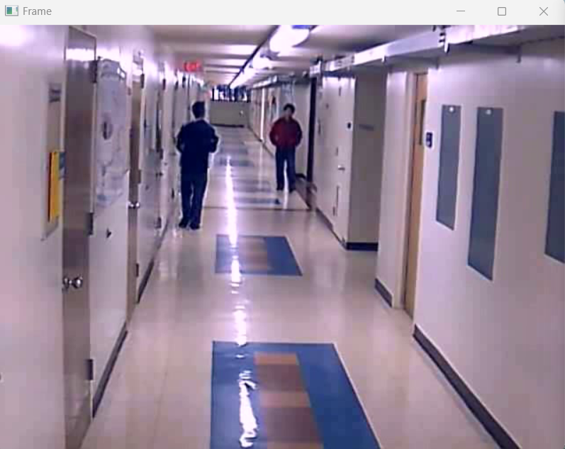
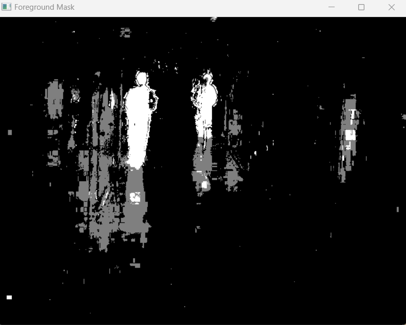

# Motion-Based Object Tracking with Background Subtraction

## Project Overview
This project uses background subtraction algorithms, specifically MOG2 and KNN, to identify and track moving objects within video frames. Background subtraction is a widely used technique for motion detection in video analysis, especially for real-time applications like surveillance and tracking.

In this project, the input video is processed to separate the moving foreground (objects) from the static background, enabling us to detect and track objects effectively.

## Implementation Steps

### 1. Configure Paths and Parameters
- Paths and parameters are set in `config.py`, which includes paths for data storage and selection of the background subtraction method (either "MOG2" or "KNN").

### 2. Background Subtraction
- Using the specified method (MOG2 or KNN), background subtraction is applied to each frame to isolate moving objects from the static background. This is handled by `apply_background_subtraction` in `background_subtraction.py`.

### 3. Video Processing and Tracking
- After processing each frame, moving objects are highlighted, and foreground masks are generated to represent tracked objects.
- The `save_video` function in `utils.py` can be used to save the processed frames into an output video.

### 4. Viewing the Results
- Real-time visualization of frames and foreground masks is shown during processing. The processed video can also be saved as an `.avi` file.

## Example Results

- The following images show an example frame from the original video and the corresponding frame after applying background subtraction and tracking.

### Original Frame


### Tracking Frame (with MOG2)


## Running the Project

1. **Prepare the Dataset**: Place the input video in the `data/raw` folder.
2. **Run the Project**:
   ```bash
   python src/main.py
   ```
3. **View and Save Results**: The processed video will be displayed during runtime, and frames can be saved in the specified output folder.

## Dependencies
- OpenCV
- Python 3.x (x >= 8)

Ensure all dependencies are installed by running:
```bash
pip install -r requirements.txt
```
