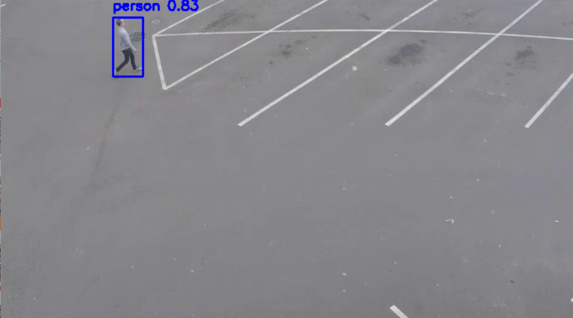

# Multi-Object Tracking with YOLO and Ultralytics

## Project Overview
This project performs real-time multi-object detection and tracking using YOLO models from the Ultralytics library. The YOLO model used can be customized in the configuration, making it easy to switch between different model versions (e.g., yolov8s.pt, yolov8m.pt, etc.). This setup is ideal for applications like surveillance, traffic monitoring, and crowd counting.

## Implementation Steps

1. **Configure Paths and Parameters**: Set paths and parameters in `config.py`, including the YOLO model path (`MODEL_PATH`) and the confidence threshold (`CONFIDENCE_THRESHOLD`).

2. **Object Detection with YOLO**: The `detection.py` module handles loading the YOLO model and performing detections on each video frame.

3. **Class Color Coding**: Utility functions in `utils.py` generate unique colors for each class, making it easy to visually distinguish between different types of detected objects.

4. **Run the Main Script**: Execute `main.py` to perform detection and tracking on a video feed, displaying the results with bounding boxes and class labels.

## Requirements

- OpenCV
- Ultralytics YOLO
- `lap` (for object tracking functionality in Ultralytics)

Install all dependencies with:
```bash
pip install -r requirements.txt
```

## Running the Project

1. **Install dependencies**:
   ```bash
   pip install -r requirements.txt
   ```

2. **Prepare a Video for Detection**:
   - Place a video file named `example_video.mp4` in the `data/raw` directory. Alternatively, update the `video_path` in `main.py` if your file has a different name.

3. **Run the Main Script**:
   ```bash
   python src/main.py
   ```

   The program will load the YOLO model, process each frame in the video, and display detections and tracks in real-time. Press `q` to exit.

## Configuration Options

You can change the YOLO model used for detection by modifying `MODEL_PATH` in `config.py`. For instance, to use a smaller or larger YOLO model, download the respective weights (e.g., `yolov8s.pt`, `yolov8m.pt`) and set the path accordingly.

## Example Detections

Below are example frames showcasing detections made using YOLO with Ultralytics:

### Original Frame


### Detection and Tracking Frame


The first image shows the original frame, and the second image illustrates the results after applying YOLO for detection and tracking. Each detected object is marked with a bounding box, label, and confidence score, color-coded by class.

---

## File Structure

The file structure of this project is as follows:

```
multi_object_tracking/
├── data/                      # Directory for datasets
│   └── raw/example_video      # Store test video files
|
├── src/                       # Source code for project modules
│   ├── __init__.py            # Initialize src as a package
│   ├── config.py              # Configuration settings (paths, parameters, etc.)
│   ├── main.py                # Main script to run the program
│   ├── detection.py           # Object detection functions (using ultralytics YOLO)
│   ├── tracking.py            # Tracking functions (if applicable)
│   └── utils.py               # Utility functions
|
├── documentation/             # Folder containing documentation images
│   ├── detection_frame01.png  # Example original frame
│   |── detection_frame02.png  # Example detection frame
|   |── README.md              # Project description and instructions
|
└── requirements.txt           # Dependencies
```

---

