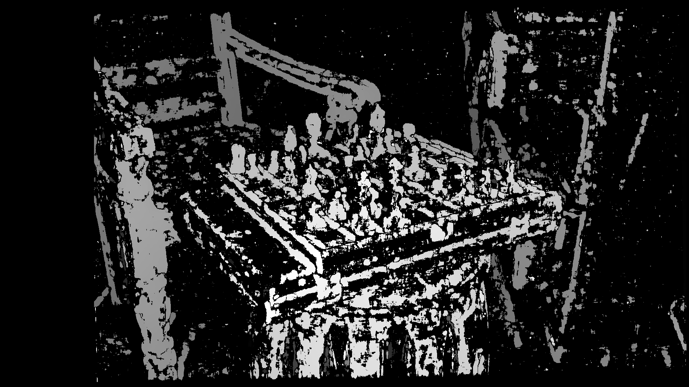

# Depth Estimation from Stereo Images with Calibration

## Project Overview
This project uses stereo vision to estimate depth from stereo image pairs, using calibration parameters to ensure accuracy. Disparity mapping techniques calculate the disparity between left and right images, which is then converted into a depth map. This setup is ideal for applications in 3D reconstruction and autonomous driving.

## Requirements
- OpenCV
- NumPy

Install all dependencies with:
```bash
pip install -r requirements.txt
```

## Running the Project

1. **Download KITTI Stereo Images**: Download stereo image pairs from the [Stereo pair Dataset](https://vision.middlebury.edu/stereo/data/scenes2021/).
2. **Prepare Stereo Images and Calibration File**:
   - Place the left and right images in the `data/chess1` directory. Ensure they are named `left_image.png` and `right_image.png`.
   - Add a `calib.txt` file with camera parameters as per the dataset used
3. **Run the Script**:
   ```bash
   python src/main.py
   ```

The resulting depth map will be saved to `data/output/disparity_map.png`.

## Example Calibration File (`calib.txt`)

```plaintext
cam0=[1761.76 0 1034.05; 0 1761.76 544.11; 0 0 1]
cam1=[1761.76 0 1034.05; 0 1761.76 544.11; 0 0 1]
doffs=0
baseline=41.51
width=1920
height=1080
ndisp=170
vmin=25
vmax=144
```

## Example Outputs

### Original Stereo Images
 

### Depth Map


The depth map shows closer objects in lighter shades and farther objects in darker shades.
