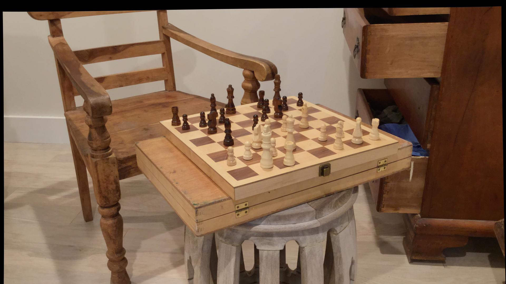
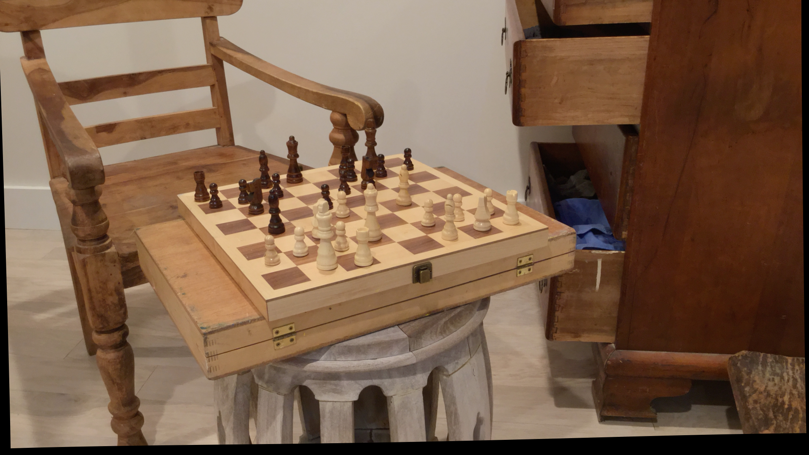
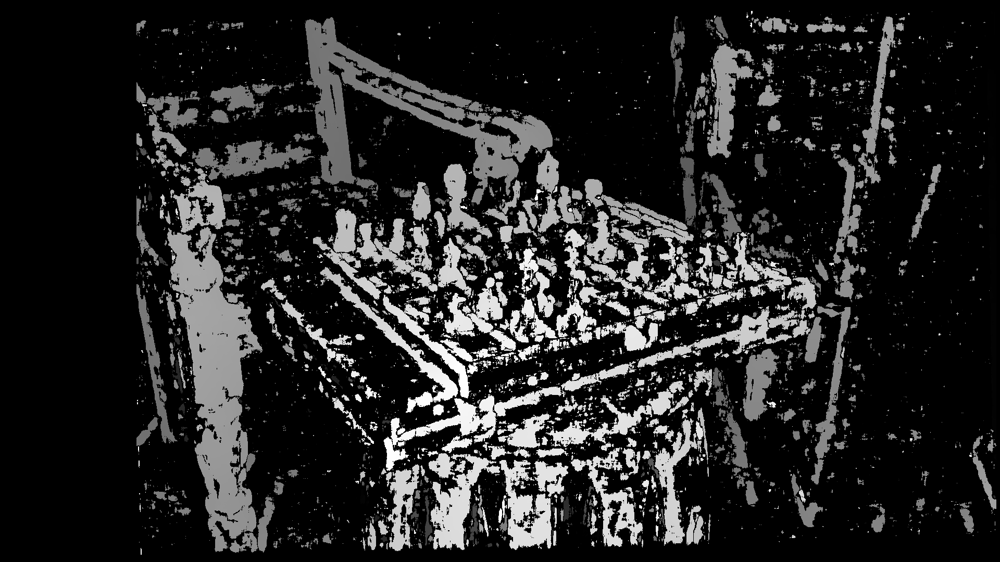
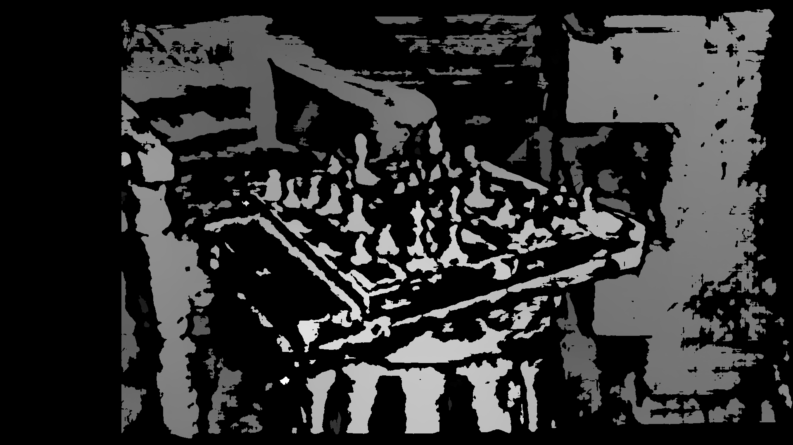

# Depth Estimation from Stereo Images with Calibration

## Project Overview
This project uses stereo vision to estimate depth from stereo image pairs, utilizing calibration parameters to ensure accuracy. Disparity mapping techniques calculate the disparity between left and right images, which is then converted into a depth map. This setup is ideal for applications in 3D reconstruction, autonomous driving, and robotics.

## Requirements
- OpenCV
- NumPy

Install all dependencies with:
```bash
pip install -r requirements.txt
```

## Running the Project

1. **Download Stereo Image Pairs**: Download stereo image pairs from the [Stereo Pair Dataset](https://vision.middlebury.edu/stereo/data/scenes2021/).
2. **Prepare Stereo Images and Calibration File**:
   - Place the left and right images in the `data/chess1` directory. Ensure they are named `left_image.png` and `right_image.png`.
   - Add a `calib.txt` file with camera parameters as per the dataset used (see example below).
3. **Run the Script**:
   ```bash
   python src/main.py
   ```

The resulting depth maps will be saved to `data/output/` with separate files for each algorithm.

## Example Calibration File (`calib.txt`)

```plaintext
cam0=[1761.76 0 1034.05; 0 1761.76 544.11; 0 0 1]
cam1=[1761.76 0 1034.05; 0 1761.76 544.11; 0 0 1]
doffs=0
baseline=41.51
width=1920
height=1080
ndisp=170
vmin=25
vmax=144
```

## Example Outputs

### Original Stereo Images
 

The depth maps display closer objects in lighter shades and farther objects in darker shades, with SGBM offering greater accuracy for complex scenes.


This project offers two main approaches for computing the disparity map, each with different strengths:


### 1. Stereo Block Matching (SBM)

Stereo Block Matching is a local method that computes disparity by matching small blocks of pixels between the left and right images. This approach is computationally efficient but may produce noisier results, particularly in regions with little texture or sharp disparity changes.

- **Advantages**: Faster, suitable for real-time applications on low-power hardware.
- **Limitations**: May produce blocky artifacts and is less accurate in low-texture areas.

Example output using **SBM**:



The disparity map generated by SBM may have visible blocky artifacts, but it provides sufficient information for simpler depth estimation tasks.

### 2. Semi-Global Block Matching (SGBM)

Semi-Global Block Matching improves on SBM by considering neighboring pixels across a larger area. It minimizes disparity inconsistencies by penalizing changes in disparity, resulting in smoother and more accurate maps, especially in challenging regions with low texture.

- **Advantages**: Produces smoother and more accurate disparity maps; handles low-texture areas and sharp edges better.
- **Limitations**: More computationally intensive, requiring more processing power.

Example output using **SGBM**:



The SGBM-generated disparity map shows fewer artifacts and a smoother, more reliable depth estimation, making it well-suited for applications requiring higher precision.

